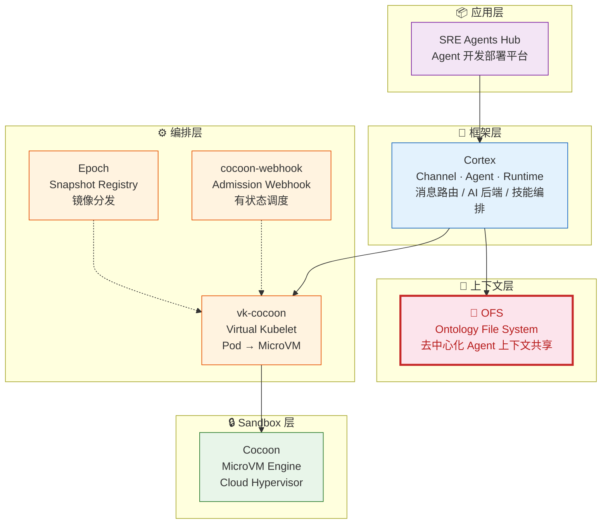

# OFS — Ontology File System

去中心化 Agent 上下文系统。每个 Agent 拥有独立数据空间，通过 TOS 对象存储共享上下文。没有中心 Server。

## CIS Agent Infrastructure

OFS 是 CIS Agent 基础设施的 **上下文层** — 提供 Agent 间去中心化的知识共享与语义对齐。完整架构见 [cocoon-docs](https://code.byted.org/CIS/cocoon-docs)。



| 组件 | 层级 | 定位 | 仓库 |
|------|------|------|------|
| **Cocoon** | Sandbox 层 | MicroVM 引擎 — Cloud Hypervisor, OCI 镜像, COW, Snapshot | [projecteru2/cocoon](https://github.com/projecteru2/cocoon) |
| **vk-cocoon** | 编排层 | K8s Virtual Kubelet — Pod → MicroVM 生命周期映射 | [CIS/vk-cocoon](https://code.byted.org/CIS/vk-cocoon) |
| **cocoon-webhook** | 编排层 | Admission Webhook — 有状态 VM 调度与亲和 | [CIS/cocoon-webhook](https://code.byted.org/CIS/cocoon-webhook) |
| **Epoch** | 编排层 | Snapshot Registry — 内容寻址存储, 跨节点分发 | [CIS/epoch](https://code.byted.org/CIS/epoch) |
| **Cortex** | 框架层 | Agent 框架 — Channel/Agent/Runtime 三层解耦 | [CIS/cortex](https://code.byted.org/CIS/cortex) |
| **OFS** | 上下文层 | Agent 上下文 — 去中心化 Ontology 文件系统 | [CIS/ofs](https://code.byted.org/CIS/ofs) |
| **SRE Agents Hub** | 应用层 | Agent 开发部署平台 — 模板, 脚本, 密钥管理 | [CIS/sre_agents_hub](https://code.byted.org/CIS/sre_agents_hub) |

## 为什么需要 OFS

当你有 3 个、30 个、甚至 10000 个 Agent 协作时，它们需要：
- **共享知识**（Agent A 诊断了告警，Agent B 需要知道结论）
- **语义对齐**（所有 Agent 对 "availability" 的理解要一致）
- **可追溯**（谁在什么时间做了什么决策，为什么）

传统方案（共享数据库、消息队列）在 Agent 场景下有根本性问题。OFS 用文件系统的思路解决这些问题。

---

## 设计思路：两轮思考

### 第一轮：去中心化 Agent 的三个根本问题

#### 问题 1: 概念漂移没有自然收敛机制

Agent A 说 "SLA 达标"，Agent B 说 "SLA 不达标" — 它们对 SLA 的定义不同。当 Agent 各自发展语义空间，**概念漂移(Concept Drift)** 不可避免。传统系统靠人工统一术语表，但 Agent 数量级上去后没法手动维护。

**OFS 解法: SharedOntology**

```
~/.ofs/ontology/           # 共享 schema — 所有 Agent 的公约
├── types/service.yaml     # "什么是服务" 的定义
├── links/depends-on.yaml  # "依赖" 的语义
└── actions/diagnose.sh    # "诊断" 的执行规范
```

- 20 个 Object Types + 7 个 Link Types 作为语义锚点
- Agent 可以 `propose(term)` 新术语 → 人工 review → `accept/reject`
- `resolve(term)` 查询时自动做别名归一化
- Schema 通过 TOS 同步到所有 Agent

#### 问题 2: Context 的价值是相对的，不是绝对的

Agent A 写了一个 "机房流量比 20%" 的对象。一周后 Agent B 拉到这个对象 — 它还有效吗？Context 的新鲜度对不同 Agent、不同场景有不同的价值。没有人能定义一个全局的 "有效期"。

**OFS 解法: 时间元数据 + Agent 自主判断**

每个对象自动携带时间维度：

```json
{
  "traffic_ratio": "50%",
  "_version": 3,
  "_valid_from": "2026-03-13T10:00:00Z",
  "_created_at": "2026-01-01T00:00:00Z",
  "_updated_at": "2026-03-13T10:00:00Z",
  "_supersedes": "MYCISB@v2"
}
```

OFS **不做自动衰减**。Agent 通过 `_updated_at` 和 `_version` 自行判断信息新鲜度。这是有意的设计决策 — OFS 存的是团队知识（SOP、预案、架构文档），不是 LLM 对话记忆。

#### 问题 3: 没有全局信用分配

告警由 Service A 触发 → Agent B 诊断 → Agent C 执行止损 → Agent D 写复盘。整个链路涉及 4 个 Agent，**谁做了什么贡献？根因在哪？影响范围多大？** 没有全局因果图，这些问题无法回答。

**OFS 解法: CausalLog — 因果有向无环图**

```typescript
interface CausalEvent {
  event_id: string;
  caused_by: string[];      // 父事件 ID（因果依赖）
  evidence: string[];       // 支撑对象 ID
  decision_rationale: string; // 为什么做这个决策
  confidence: number;        // 置信度 0-1
}
```

查询能力：
- `traceBack(eventId)` — 找到所有因（根因分析）
- `traceForward(eventId)` — 找到所有果（爆炸半径）
- `attribute(objectId)` — 找到创建/修改这个对象的因果链

---

### 第二轮：HydraDB 对传统 RAG 的五个批判

[HydraDB](https://hydradb.com/) 论文指出传统 RAG 的五个致命缺陷。OFS v3 逐一回应：

| # | HydraDB 批判 | OFS 症状 | OFS 解法 | 状态 |
|---|---|---|---|---|
| 1 | **时间扁平化** — 向量库无时序 | `ofs write` 覆写丢失历史 | `_version` + `_supersedes` 版本链 | 已实现 |
| 2 | **破坏性更新** — 覆写丢决策轨迹 | Event 只记 "被更新了"，不记旧值 | Event 携带完整 `before`/`after` 快照 | 已实现 |
| 3 | **决策痕迹缺失** — 不知道 "为什么" | 只有结果对象，没有决策过程 | `event.reason` 字段 + CausalEvent | 已实现 |
| 4 | **语义碎片化** — 分块破坏关系 | SOP 分散在多篇文档，演进关系丢失 | `_supersedes` 版本链 + `source_url` 追溯 | 已实现 |
| 5 | **记忆衰减缺失** — 无用记忆应淡化 | 所有对象永久存在 | **不实现** — 团队知识不该自动删除 | 设计决策 |

**关于问题 5 的抉择**：HydraDB 的 Ebbinghaus 衰减模型适用于个人对话历史，不适用于 SOP、预案、架构文档等需要长期保留的运维知识。OFS 不自动删除过时对象 — Agent 通过 `_updated_at` 自行判断新鲜度。

---

## 架构

```
               ┌─────────────────────────────────────────────┐
               │           Shared Ontology (Schema)          │
               │  types/*.yaml  links/*.yaml  actions/*.sh   │
               └────────────────────┬────────────────────────┘
                                    │ 语义锚点
               ┌────────────────────┼────────────────────────┐
               │                    │                        │
        ┌──────┴──────┐     ┌──────┴──────┐          ┌──────┴──────┐
        │  Agent A    │     │  Agent B    │          │  Agent C    │
        │ ~/.ofs/     │     │ ~/.ofs/     │          │ ~/.ofs/     │
        │  agents/    │     │  agents/    │          │  agents/    │
        │   A/objects │     │   B/objects │          │   C/objects │
        │   A/links   │     │   B/links   │          │   C/links   │
        └──────┬──────┘     └──────┬──────┘          └──────┬──────┘
               │                   │                        │
               │    write-through  │                        │
               └──────────┬────────┘────────────────────────┘
                          │
                   ┌──────┴──────┐
                   │     TOS     │  ByteDance Object Storage
                   │  Shared Bus │  (S3-compatible, x-tos-access)
                   │             │
                   │ ofs/<agent>/ │
                   │  manifest   │
                   │  objects    │
                   └─────────────┘
```

**数据流**: Agent 写本地 → 自动推 TOS → 其他 Agent 从 TOS 拉 → 本地读

---

## 四原语 + Event

基于 [Palantir Ontology](https://www.palantir.com/platforms/ontology/) 的四原语，加上 Event 作为第五原语：

| 原语 | 文件系统映射 | 说明 |
|---|---|---|
| **Object Type** | `ontology/types/<name>.yaml` | 实体类型定义 |
| **Property** | type YAML 中的 `properties` 字段 | 属性定义 |
| **Link** | `ontology/links/<name>.yaml` | 关系定义 |
| **Action** | `ontology/actions/<name>.sh` | 可执行操作 |
| **Event** | `~/.ofs/events/events.jsonl` | 不可变事件日志 |

---

## 快速上手

### 安装

```bash
# 1. 把 CLI 放到 PATH
cp cli/ofs /usr/local/bin/ofs
chmod +x /usr/local/bin/ofs

# 2. 初始化 Agent
ofs init my-agent
ofs register my-agent inspection localhost '["inspect","report"]'

# 3. (可选) 配置 TOS 共享
cat > ~/.ofs/tos.env << EOF
TOS_ACCESS_KEY=your_key
TOS_SECRET_KEY=your_secret
TOS_BUCKET=your_bucket
EOF
```

### 基本操作

```bash
# 写入对象 (自动版本管理 + write-through TOS)
echo '{"psm":"my.service","region":"cn-north-1"}' | ofs write my-agent service my.service
# 输出: wrote: service/my.service (v1)

# 更新 (自动递增版本，保留 before/after 快照)
echo '{"psm":"my.service","region":"cn-north-2"}' | ofs write my-agent service my.service
# 输出: wrote: service/my.service (v2)

# 读取
ofs read my-agent service my.service

# 查看变更历史 (版本链 + 字段级 diff)
ofs history service my.service

# 列出所有对象
ofs ls my-agent

# 查看 schema
ofs schema types
ofs schema links
ofs schema show service
```

### Agent 间共享

```bash
# Agent A: 写入数据 (自动推送 TOS)
echo '{"status":"healthy"}' | ofs write agent-a service my.svc

# Agent B: 建立链接并拉取
ofs link agent-b agent-a shares-context '{"permissions":"read"}'
ofs pull agent-a                    # 从 TOS 拉取 Agent A 的所有对象
ofs read agent-a service my.svc     # 读取共享数据

# 发现网络中所有 Agent
ofs discover
```

---

## Context Manager: 三层上下文

TypeScript Engine 提供三层上下文管理，映射 Agent 的认知过程：

```
L1 Intent        → 当前目标、约束、关注的对象类型
L2 Working Memory → 活跃对象 (最近读写的实体)
L3 Episodic Store → 历史事件日志 (append-only)
```

### L1: Intent

```typescript
engine.setIntent({
  goal: "诊断 MYCISB 机房的 RDS 告警",
  constraints: ["v3 temporal versioning", "write-through TOS"],
  focusTypes: ["alert", "service", "infra-component"],
});
```

### L2: Working Memory

```typescript
// 读取对象时自动进入 Working Memory
const alert = await engine.getObject("alert", "alert-001");
// Working Memory 自动追踪 access_count, last_accessed
// 定期 compact: 低频访问的对象移入 L3
```

### L3: Episodic Store

```typescript
// 所有变更自动记录为不可变事件
const history = await engine.getObjectHistory("service", "my.svc");
// 时间旅行: 查询任意时间点的对象状态
const snapshot = await engine.getObjectAtTime("service", "my.svc", "2026-03-01");
```

---

## v3 时间维度

### 对象版本元数据

每次 `ofs write` 自动注入：

```json
{
  "psm": "my.service",
  "_version": 3,
  "_valid_from": "2026-03-13T10:00:00Z",
  "_created_at": "2026-01-01T00:00:00Z",
  "_updated_at": "2026-03-13T10:00:00Z",
  "_supersedes": "my.service@v2"
}
```

### 事件日志 (before/after)

每次 write/rm 自动记录不可变事件：

```json
{
  "event_id": "uuid",
  "event_type": "update",
  "object_type": "service",
  "object_id": "my.service",
  "agent_id": "my-agent",
  "timestamp": "2026-03-13T10:00:00Z",
  "before": {"psm":"my.service","region":"cn-north-1","_version":2},
  "after":  {"psm":"my.service","region":"cn-north-2","_version":3},
  "object_version": 3,
  "reason": "机房流量切换"
}
```

### 时间旅行查询

```typescript
// TypeScript Engine
const v1 = await engine.getObjectAtTime("datacenter", "MYCISB", "2026-01-15");
const v3 = await engine.getObjectAtTime("datacenter", "MYCISB", "2026-03-15");
// v1.traffic_ratio = "20%", v3.traffic_ratio = "50%"
```

```bash
# CLI
ofs history datacenter MYCISB
# History: datacenter/MYCISB (3 events)
# ────────────────────────────────────────────
#   [2026-01-01] v1 create by sys-diagnosis
#   [2026-02-15] v2 update by sys-diagnosis
#     traffic_ratio: "20%" → "35%"
#   [2026-03-13] v3 update by sys-diagnosis
#     traffic_ratio: "35%" → "50%"
```

---

## pi-mono Agent 集成示例

`examples/pi-mono/` 包含一个最简单的 pi-mono agent，展示 OFS 集成模式。

### 目录结构

```
examples/pi-mono/
├── runner.ts              # Agent 入口 (~60 行)
├── skills/
│   ├── hello.ts           # 测试 tool
│   ├── ofs-read.ts        # OFS 读取 tool
│   └── ofs-write.ts       # OFS 写入 tool
├── conf/
│   └── prompt.md          # System prompt
└── package.json           # 依赖
```

### 运行

```bash
cd examples/pi-mono
npm install

# 初始化 OFS
ofs init my-agent

# 运行 Agent
AGENT_ID=my-agent OPENAI_API_KEY=sk-xxx npx tsx runner.ts "写一个测试对象到 OFS"
```

### Agent 核心模式 (~20 行)

```typescript
import { Agent } from "@mariozechner/pi-agent-core";

const agent = new Agent({
  initialState: {
    systemPrompt: "You are an OFS agent...",
    model: volcengineModel,
    tools: [helloTool, ofsReadTool, ofsWriteTool],
    thinkingLevel: "off",
  },
  getApiKey: async () => process.env.OPENAI_API_KEY!,
});

await agent.prompt("Your task here...");
```

### AgentTool 接口

```typescript
import { Type } from "@sinclair/typebox";
import type { AgentTool, AgentToolResult } from "@mariozechner/pi-agent-core";

export const myTool: AgentTool = {
  name: "tool_name",
  label: "Human Name",
  description: "What this tool does",
  parameters: Type.Object({
    param1: Type.String({ description: "..." }),
  }),
  execute: async (toolCallId, params): Promise<AgentToolResult<any>> => {
    return {
      content: [{ type: "text", text: "Result" }],
      details: { structured: "data" },
    };
  },
};
```

---

## CLI 命令参考

### Schema (共享本体)

| 命令 | 说明 |
|---|---|
| `ofs schema types` | 列出所有实体类型 |
| `ofs schema links` | 列出所有关系类型 |
| `ofs schema show <name>` | 查看具体定义 |

### 本地操作

| 命令 | 说明 |
|---|---|
| `ofs init <agent_id>` | 初始化 Agent |
| `ofs write <agent> <type> <id> [file]` | 写入对象 (stdin 或文件，自动版本管理 + TOS) |
| `ofs read <agent> <type> <id>` | 读取对象 |
| `ofs rm <agent> <type> <id>` | 删除对象 |
| `ofs ls <agent>` | 列出所有对象 |
| `ofs history <type> <id>` | 版本历史 (含 diff) |
| `ofs link <from> <to> <link_type> [props]` | 创建链接 |
| `ofs links <agent>` | 列出链接 |
| `ofs event <agent> <type> <obj_type> <id> [data]` | 追加事件 |
| `ofs events [agent]` | 查看事件日志 |

### TOS 共享

| 命令 | 说明 |
|---|---|
| `ofs push <agent> [type] [id]` | 推送到 TOS |
| `ofs pull <agent> [type] [id]` | 从 TOS 拉取 |
| `ofs tos-ls [agent]` | 列出 TOS 上的对象 |
| `ofs tos-read <agent> <type> <id>` | 直接读 TOS (不存本地) |
| `ofs sync <agent>` | 双向同步 |
| `ofs discover` | 发现所有 Agent 的 manifest |

### Agent 注册

| 命令 | 说明 |
|---|---|
| `ofs register <id> <type> <host> [caps]` | 注册 Agent |
| `ofs agents` | 列出已注册 Agent |
| `ofs whoami` | 查看 OFS 配置 |

---

## 目录结构

```
ofs/
├── cli/
│   └── ofs                    # Bash CLI (主入口)
├── ontology/                  # 共享本体定义
│   ├── types/                 # 20 个 Object Types
│   │   ├── service.yaml       # 微服务
│   │   ├── alert.yaml         # 告警
│   │   ├── datacenter.yaml    # 机房
│   │   ├── runbook.yaml       # 运维手册
│   │   ├── sop.yaml           # SOP 流程
│   │   └── ...
│   ├── links/                 # 7 个 Link Types
│   │   ├── depends-on.yaml    # 服务依赖
│   │   ├── shares-context.yaml # 上下文共享
│   │   ├── delegates-to.yaml  # 任务委派
│   │   └── ...
│   └── actions/               # 可执行操作
│       ├── diagnose.sh
│       ├── query-topology.sh
│       └── ...
├── src/ofs/                   # TypeScript Engine
│   ├── engine.ts              # 核心 CRUD + v3 时间维度
│   ├── types.ts               # 类型定义
│   ├── event-log.ts           # 不可变事件日志
│   ├── causal-log.ts          # 因果 DAG
│   ├── context-manager.ts     # L1/L2/L3 三层上下文
│   ├── shared-ontology.ts     # 术语注册表
│   ├── graph.ts               # 图遍历
│   ├── storage/               # 存储后端
│   │   ├── local.ts           # 本地文件系统
│   │   ├── hybrid.ts          # 本地 + TOS write-through
│   │   └── tos-native.ts      # ByteDance TOS
│   └── ...
├── examples/pi-mono/          # 最简 pi-mono Agent 示例
│   ├── runner.ts
│   ├── skills/
│   └── package.json
└── docs/                      # 扩展文档
```

---

## 设计原则

1. **Context as Files** — 所有持久化通过 JSON 文件，不走数据库
2. **Bash Bootstrap** — CLI 是纯 Bash，Action 是 Bash 脚本，零运行时依赖
3. **Single Select, No Merge** — 委派任务只选一个结果，不做复杂合并
4. **Write-Through** — `ofs write` 同时写本地 + TOS，无需手动 push
5. **Append-Only Events** — 事件日志不可变，对象是可变的当前快照
6. **Version Chain** — `_version` + `_supersedes` 形成版本链，可回溯任意版本
7. **Decision Trace** — 每次变更记录 why (reason)，不只记录 what (data)
8. **Time-Travel via Events** — 不存历史版本文件，通过 event log 重建任意时间点
9. **No Auto-Decay** — 团队知识不自动删除，Agent 通过 `_updated_at` 自行判断新鲜度
10. **Manifest Discovery** — 每个 Agent 在 TOS 维护 manifest.json，`ofs discover` 看全网

---

## License

Internal use only.
